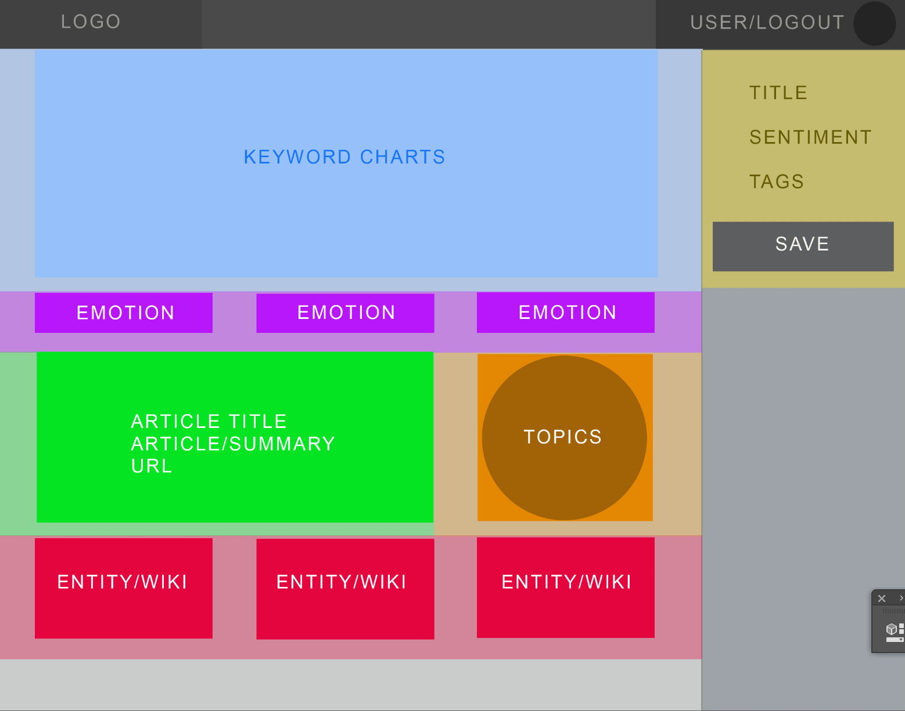
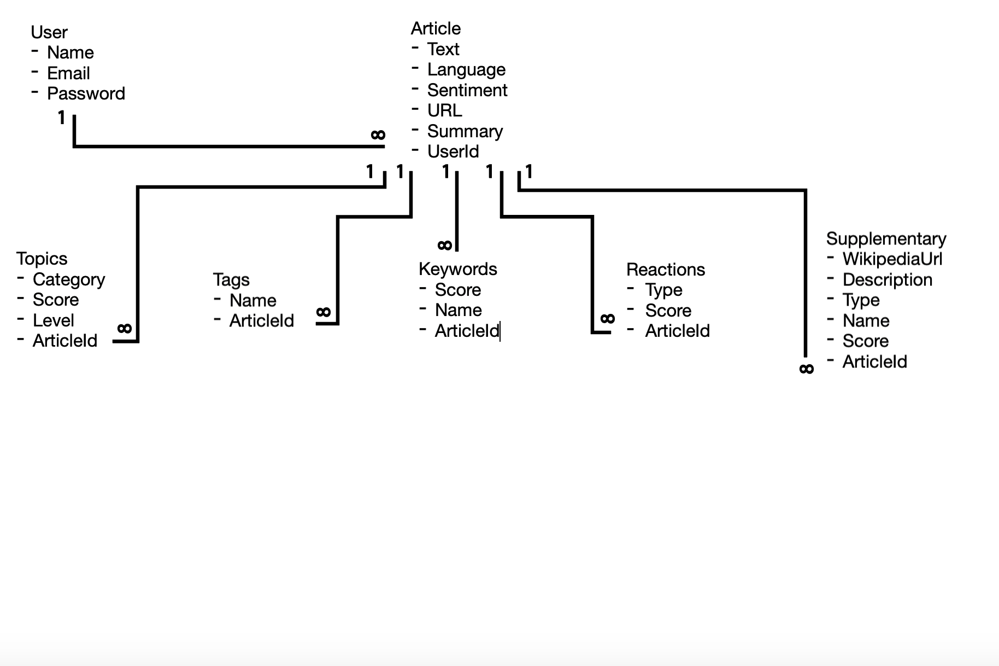

# BabbleSmash-Unit2-GA

**Introduction**

This is my unit2 project for General Assembly. This app is a proof of concept, with full user authentication/authorization, that takes a URL submitted by user and renders it using a data science API. the returned information would then include content tags, sentiment analysis, text summarization, charts, graphs and supplemental article info via additional API queries.

**Foundation**

This project was built with Node.js, Express, Sequelize, and Pug. At the heart and soul of this program is a Data Science API from [Yonder Labs](yonderlabs.com)

**Inspiration**

The inspiration for this project came from a conversation that I had with a friend. "How can we extract knowledge from an article as fast as humanly possible? The fuggin computer can do everything for us as it is, it should be able to read and summarize an article for us as well." That drunken conversation was put to the test here and "BabbleSmash" was born. 

**User experience, API selection, wireframing and the "Smash" process**

**User experience**

I did my best to design the experience using a variety of inspiration that I've accumulated over the years. In a nutshell:

* User Registers for use using a call to action on home page
* They are taken to a profile page where they can see run their URL through the "Smashbar". The profile page is their homepage on the site and contains all the information and resources they will need to use the service
* The user will have full CRUD functionality and data will not be stored on the service unless they specifically save it. 

**Wireframing**

Wireframing was done with careful attention to detail. I had to review and look at several different dashboards and UI panels for inspiration as the information delivered would be very specific and involved. The crown jewel of the site is the results page and I had to make sure that it looked every bit as impressive as the API that supports it

**API Selection**

I spent an extensive amount of time looking for solutions to power this concept, including even making my own. I reviewed several different opportunities for this project and ultimately selected Yonder Labs as the API solution that will be used. 

Yonder Labs is a company out of Trento, Italy that specializes in providing text analytics for their clients. 

**Database Model**

THe database model in use was designed, first hand, for use with the Yonder Labs API and can save all information provided. THe solution will need further development over time to make full use of the database model.

**Development Log**

**Day 1**

The project began with making mental notes and looking for user experience inspiration. It was very important to me to make sure that the site design supported a progressive and healthy workflow that made sense and that I could use into my future as a developer.
Then, I focus my attention towards the API. I had been doing research for weeks previous and narrowed down my finalists. I send emails to several of my possible opportunities and ultimately chose Yonder labs. I talked with their senior data scientist by email and received the necessary API key for Authentication.
After looking at several sites, I used Photoshop to book scrap ideas and then went to work on laying things out. The process was relatively unremarkable but I've provided enough detail during this process to act as a springboard for the days to come. 
I chose to rebel against the use of EJS as a view engine and developed a lot of firsthand experience with pug at this time.
The crown jewel of my website is the results page and I built all the other pages around that Central resource. My goal was to make sure that all supporting pages gave the necessary synergy so that the result page could do it's magic.

**Day 2**

The second day was spent looking at home page, profile page, login / logout out inspiration. For the front page, I ultimately went with a single page, Parallax design that told the story to the best of my ability. I made careful notes and went about looking for stylistic inspirations.
Ultimately, I decided to use Google fonts with the following font choice.
I chose unsplash to provide the hero image. And then I went about brainstorming on heading, subheading, and text content. 
Once I had my concrete decisions made regarding the graphical and design, I went about building the scaffolding for the front page. I chose a mobile-first philosophy because I wanted to make sure that the site was fully responsive.

**Day 3**

Day 3 was spent extensively working on graphics/layout on the front page and the results page. I looked to my wireframe for guidance on the layout and found that I needed to make a couple tweaks to the information as presented.
During this time, I worked on my API understanding and made sure that I ran some tests through curl and retrieved the Json results. I'm a careful notes on my database model at this time
I finished up my development session making sure that I had placeholders and basic functionality for the front page, login page, logout page, and profile page

**Day 4**

I met with Steve, my instructor, and pitched the idea and overall basis for the project. After review, we discussed potential items that would be needed for making my presentation and overall Vision come to life. I chose chart. JS for the graphics on it analytics and work with in bootstrap 2 provide the visual constructs and overall look and feel for this project. It was important for me to make sure that, even with the limited amount of time we have, that things look presentable and modern.
I spend a vast majority of the day testing the API and making careful notes on the organization of materials that came back from the post.

**Day 5**

Well into the project at this point, my goal was to make sure that the API information provided, via Yonder Labs, was working to my satisfaction. 

Creating the post route to grab the API results proved to be a challenge. I had limited experience with how to form my post request Within axios and there was limited documentation on the Yonder Labs API site for using anything other than curl. Through additional testing I was able to determine the right header configuration that I needed to use and how to stringify the key value pairs in the body to make sure that I was getting clean 200. 

I ran several tests with a collection of URL articles and meter from those on how the API was evolving and changing with each response. During this time. I learned a lot about the emotional reaction and sentiment analysis. I was able to determine the amount of possible emotional reactions and the extent of the sentiment analysis. I didn't Focus my attention towards how it's topic generation was done and wrote code to support it. At the end of this day I was able to determine that the results page was properly looping through the result data and displaying relevant information on to the result page.
Once I verified that all information was going on page properly. I made sure to Shakedown the boilerplate that I was using for my Express, node, and Sequelize set up. I verified all dependencies and tested every component. I made some mistakes during this time with trying to omit Auth dependencies in hopes of revising and streamlining my understanding of the components. I had to take a detour and restore back. After restore, I confirmed that all authentication was working properly and that my sessions were working without error.

By end of day, all of my basic functionality was working with the exception of saving results to database. 

**Day 6**

I set forth on making sure that I was tying up loose ends at this point. I had taken a lot of measurements I had made a lot of notes within my CSS, and I had done a lot of previous API testing. With all of that done, it was now important to make sure that everything was starting to fit in place and work accordingly. I tested all of my crud routes and wrote revisions to those routes and made sure that all of my URL links we're working properly.

I polished up my loops and clean up the code so that I was no longer getting errors during the rendering on my results page
The day proved to be exceptionally difficult with trying to create a post route that pushed all the API data to my database models. All of my knowledge and experience was tested and I didn't have a example in my knowledge base of this particular use case

